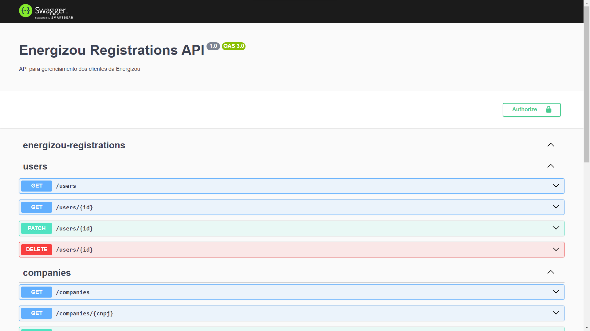

# Energizou Registrations Backend

A platform for customers managment built with NestJS and React. It was developed during a technical test of a [Energizou](https://www.linkedin.com/company/energizou/) selection process.



## About

As custom features, I implemented

- JWT authentication with [Passport.js](https://www.passportjs.org/);
- authorization policies using [Casl](https://casl.js.org/v6/en)
- interactive documentation with Swagger;

## Requirements

- Docker and Docker Compose (instalation guide [here](https://docs.docker.com/compose/install/))

## Instalation

In order to install the project locally, run

```bash
# define the compose file
export COMPOSE_FILE=docker-compose.development.yml

# build the containers
docker compose build
```

## Running the app

To run the API in a development environment, execute

```bash
# development
docker compose up
```

now, the resources are available on the [localhost](http://localhost:8000) (see the documentation http://localhost:8000/docs).

## Test

```bash
# unit tests
docker compose exec -it nest npm run test

# e2e tests
docker compose exec -it nest npm run test:e2e

# test coverage
docker compose exec -it nest npm run test:cov
```
